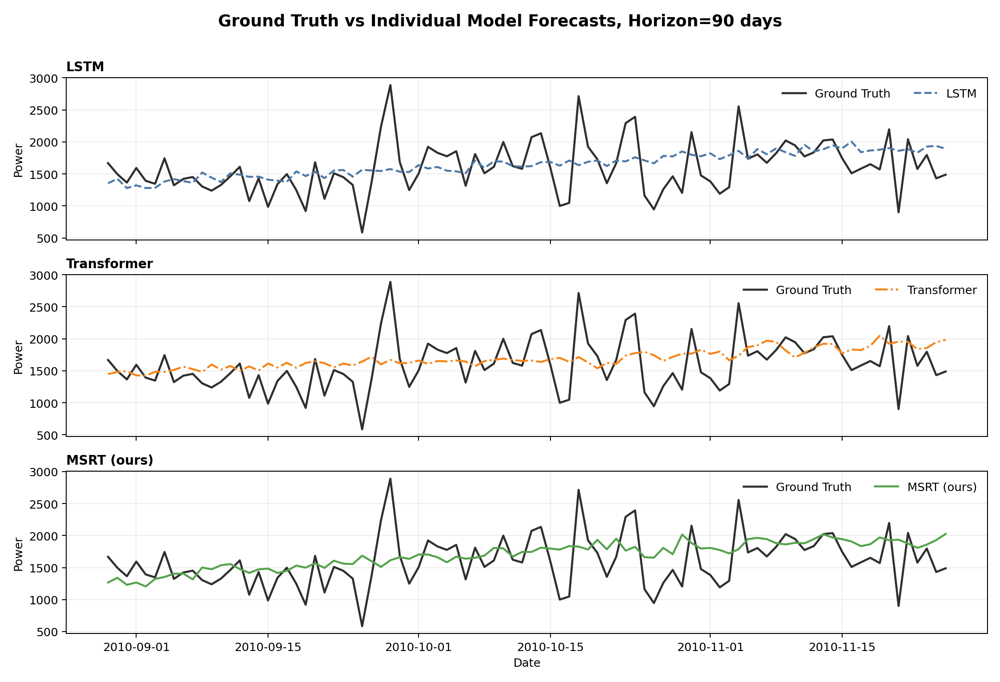
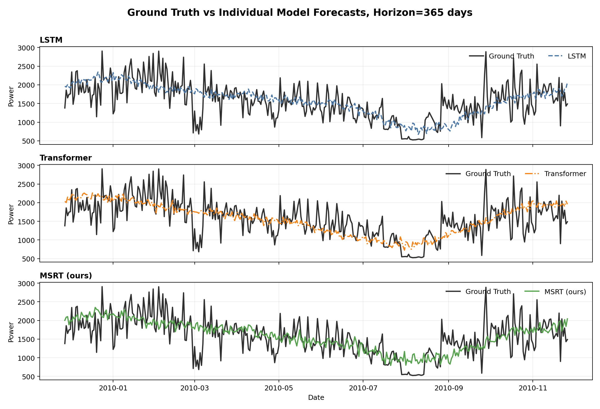

# 基于多变量时间序列的家庭电力消耗预测

作者信息：请填写姓名、学号、研究方向  
作者贡献：请填写数据处理、模型实现、实验分析、报告撰写等分工  
代码 GitHub 链接：https://github.com/asda8sdm/Finalterm_homwwork  
AI 工具说明：报告文字润色和结构整理过程中使用了 ChatGPT/Codex 辅助，实验设计、代码运行与结果解释由作者核查。

## 摘要

本文研究家庭电力消耗的多变量时间序列预测问题。基于 UCI Individual household electric power consumption 数据集，将分钟级用电记录聚合为日尺度序列，并融合 Météo-France 月度气象变量作为外部特征。实验任务为使用过去 90 天数据分别预测未来 90 天和 365 天的 `global_active_power`。本文实现 LSTM、Transformer 两个基线模型，并提出预测长度自适应的 MSRT 模型。MSRT 在短期预测中使用 LSTM 锚定和多尺度天气残差，在长期预测中进一步引入 DLinear 趋势/残差分解分支。五个随机种子的实验表明，MSRT 在 90 天和 365 天任务上均取得最低平均 MSE。

## 1. 问题介绍

本项目面向 UCI “Individual household electric power consumption” 数据集，目标是根据过去 90 天的家庭用电和外部气象信息，预测未来每一天的 `global_active_power` 曲线。按照课程要求，分别训练短期 90 天预测模型和长期 365 天预测模型，且两种预测长度的参数不共享。

## 2. 数据集与预处理

### 2.1 数据来源

原始用电数据来自 UCI “Individual household electric power consumption” 数据集，记录法国一户家庭从 2006-12-16 至 2010-11-26 的分钟级用电信息。天气数据来自 data.gouv.fr 上 Météo-France 的月度基础气候数据，本文选择巴黎近郊 Hauts-de-Seine 省（92）月度文件 `MENSQ_92_previous-1950-2024.csv.gz`，并按月份映射到每日样本。

### 2.2 日尺度聚合

原始分钟级数据先按日期聚合为 1442 个日尺度样本。聚合规则严格按照课程要求执行：`global_active_power`、`global_reactive_power`、`sub_metering_1`、`sub_metering_2`、`sub_metering_3` 按日求和；`voltage`、`global_intensity` 按日求均值；缺失值先在分钟级按时间插值，再在日尺度按时间补齐。额外计算剩余分表电量：

```text
sub_metering_remainder =
    global_active_power * 1000 / 60
    - (sub_metering_1 + sub_metering_2 + sub_metering_3)
```

天气变量包括 `RR`、`NBJRR1`、`NBJRR5`、`NBJRR10`、`NBJBROU`。其中 `RR` 按说明除以 10 转换为毫米，其余变量表示当月达到不同降水阈值或出现雾天的天数。由于天气数据为月度统计，本文将同一月份的天气值赋给该月所有日样本。为增强周期信息，还加入星期、月份和年内日序的正余弦编码。

最终输入特征共 19 个：`global_active_power`、`global_reactive_power`、`sub_metering_1`、`sub_metering_2`、`sub_metering_3`、`voltage`、`global_intensity`、`sub_metering_remainder`、`RR`、`NBJRR1`、`NBJRR5`、`NBJRR10`、`NBJBROU`、`dow_sin`、`dow_cos`、`month_sin`、`month_cos`、`dayofyear_sin`、`dayofyear_cos`。

### 2.3 数据划分与滑动窗口

为了避免未来信息泄露，数据集按时间顺序划分，而不是随机划分。由于 365 天预测需要 90 天输入和 365 天输出，测试集必须至少覆盖 455 天，因此本文采用约 65%/35% 的时间切分：

| 数据部分 | 日期范围 | 天数 | 用途 |
|---|---|---|---|
| Train | 2006-12-16 至 2009-07-09 | 937 | 拟合模型参数，并从末尾划出验证窗口 |
| Test | 2009-07-10 至 2010-11-26 | 505 | 仅用于最终评估 |

每个样本由连续 90 天输入和后续 horizon 天输出组成，即样本长度为 `90 + horizon`。训练集末尾 15% 的窗口作为验证集，用于早停和模型选择。不同预测长度的窗口数量如下：

| 预测长度 | 输入长度 | 训练窗口 | 验证窗口 | 测试窗口 |
|---|---|---|---|---|
| 90 天 | 90 天 | 645 | 113 | 326 |
| 365 天 | 90 天 | 411 | 72 | 51 |

## 3. 方法

### 3.1 LSTM 基线

LSTM 使用两层循环网络编码过去 90 天的多变量序列，取最后时间步隐藏状态，经 LayerNorm、GELU 和全连接层一次性输出未来 90 或 365 天。该模型适合作为序列建模基础题，能够捕捉局部和中期依赖，但长期预测时容易受到误差累积和表示容量限制。

### 3.2 Transformer 基线

Transformer 基线先将输入特征映射到隐藏维度，加入正弦位置编码，再使用 Transformer Encoder 建模 90 天窗口内任意两天之间的依赖。预测头拼接最后时间步表示和全局平均池化表示后输出完整预测曲线。相比 LSTM，Transformer 对远距离依赖更直接，但在样本量较小的情况下也更容易过拟合。

### 3.3 自定义模型：MSRT

本文提出 Horizon-Adaptive Multi-Scale Seasonal Residual Transformer（MSRT）。它包含六个关键设计：

1. LSTM 锚定分支：保留循环网络对短期连续趋势的稳定刻画，直接输出一个主预测。
2. 预测长度自适应：90 天短期预测关闭 DLinear 趋势分解，使用更灵活的多尺度残差；365 天长期预测启用 DLinear，以增强趋势外推能力。
3. DLinear 趋势/残差分解分支：对目标序列做 25 天滑动平均，分离 trend 与 seasonal/residual，再分别用线性层映射到未来 365 天。
4. 多尺度局部模式提取：使用 3、7、15 天深度可分离卷积分支，分别覆盖短期波动、周周期和半月尺度变化。
5. 天气门控与 Transformer 全局编码：用降水和雾天变量生成门控向量调节局部特征，再通过 Transformer Encoder 建模全窗口依赖。
6. 小幅季节性残差修正：以“最后一天用电水平”和“最近一周用电模式重复”构造可解释季节基线，残差分支只做校正，避免破坏 LSTM 锚定预测的稳定性。

简化伪代码如下：

```text
X = 过去90天多变量序列
Y_lstm = LSTM_direct_head(X)
if horizon == 365:
    trend, seasonal = moving_average_decompose(target(X))
    Y_dlinear = LinearTrend(trend) + LinearSeasonal(seasonal)
    anchor = gate(weather_stats, power_stats) * Y_lstm + (1-gate) * Y_dlinear
else:
    anchor = Y_lstm
Z = Linear(X)
C = mean(Conv3(Z), Conv7(Z), Conv15(Z))
G = sigmoid(MLP(mean(weather_features(X))))
H = TransformerEncoder(Z + G * C)
P = concat(last(H), mean(H), attention_context(H))
baseline = gate(P) * repeat(last_7_days_power) + (1 - gate(P)) * last_day_power
prediction = anchor + sigmoid(alpha) * residual_correction(baseline, P, power_stats)
```

三种模型的主要参数设置如下：

| 模型 | 主要结构 | 90 天参数量 | 365 天参数量 |
|---|---|---|---|
| LSTM | 2 层 LSTM(hidden=64) + LayerNorm + MLP 直接多步输出 | 65,178 | 83,053 |
| Transformer | Linear projection(d=64) + 2 层 Transformer Encoder(head=4) + pooling head | 115,610 | 133,485 |
| MSRT | LSTM anchor + 多尺度卷积(k=3/7/15) + 天气门控 + Transformer 残差；365 天启用 DLinear | 269,119 | 426,144 |

## 4. 实验设置

所有特征和目标变量均使用训练集统计量进行标准化，测试集只使用训练集 scaler 变换，避免测试信息泄露。模型训练采用 AdamW 优化器，目标函数为标准化目标上的 MSELoss；最终汇报时，将预测值反标准化回原始日尺度 `global_active_power` 后计算 MSE 和 MAE。每个模型在每个 horizon 上使用 5 个随机种子重复实验，并报告均值和标准差。关键训练设置如下：

| 项目 | 设置 |
|---|---|
| 随机种子 | 2026、2027、2028、2029、2030 |
| 优化器 | AdamW |
| 损失函数 | MSELoss，在标准化后的 `global_active_power` 上训练 |
| 批大小 | 128 |
| 权重衰减 | 1e-4 |
| 梯度裁剪 | max norm = 1.0 |
| 早停 | 验证集 MSE 无改善时停止 |
| LSTM/Transformer | lr=1e-3，epochs=50，patience=8 |
| MSRT 90 天 | lr=1e-3，epochs=50，patience=8 |
| MSRT 365 天 | lr=3e-4，epochs=90，patience=12 |
| 硬件/框架 | PyTorch，CUDA 可用时使用 GPU |

## 5. 结果与分析

评价指标为 MSE 和 MAE。表中 std 为 5 个随机种子的标准差，反映模型稳定性。

| 预测长度 | 模型 | MSE 均值 | MSE std | MAE 均值 | MAE std |
|---:|---|---:|---:|---:|---:|
| 90 | msrt | 152957.7313 | 4161.7212 | 301.0286 | 4.5149 |
| 90 | lstm | 158054.2250 | 5831.5399 | 305.8512 | 5.9483 |
| 90 | transformer | 163717.0469 | 11734.7844 | 311.7473 | 12.4712 |
| 365 | msrt | 159393.9844 | 8654.3241 | 307.7473 | 11.5873 |
| 365 | lstm | 161620.6500 | 7855.8979 | 310.6813 | 9.8708 |
| 365 | transformer | 171289.1500 | 9035.7139 | 322.9728 | 11.3954 |

- 90 天预测中，`msrt` 的平均 MSE 最低，MSE=152957.7313，MAE=301.0286。
- 365 天预测中，`msrt` 的平均 MSE 最低，MSE=159393.9844，MAE=307.7473。

自定义模型 MSRT 的相对表现如下：

- 90 天预测中，MSRT 相比 LSTM 的 MSE 降低 3.22%。
- 90 天预测中，MSRT 相比 Transformer 的 MSE 降低 6.57%。
- 365 天预测中，MSRT 相比 LSTM 的 MSE 降低 1.38%。
- 365 天预测中，MSRT 相比 Transformer 的 MSE 降低 6.94%。

90 天预测曲线对比如下。为避免多条曲线堆叠影响阅读，图中按模型分成三个子图，每个子图只展示该模型与 Ground Truth 的对比：



365 天预测曲线对比如下：



从结果可以看出，短期预测主要考察模型对最近趋势与周周期的跟踪能力；长期预测更依赖稳定的趋势外推和季节性归纳偏置。MSRT 在 90 天任务上关闭 DLinear 分支，避免线性趋势外推对短期局部模式造成过拟合；在 365 天任务上启用趋势/残差分解分支，使模型可以同时利用 LSTM 的稳定时序表示、DLinear 的长期趋势外推和 Transformer 的多尺度天气残差校正。

## 6. 讨论

本实验的难点在于样本量较小：日尺度样本只有 1442 天，而 365 天预测窗口会显著减少可用训练样本。因此，模型并不是越大越好，显式引入周期性、天气门控和残差预测比单纯增加 Transformer 层数更稳健。

仍可改进的方向包括：引入温度、湿度、风速等更多气象变量；将未来已知的日历特征作为 decoder 输入；使用分位数损失刻画预测不确定性；以及采用滚动起点评估来更全面地衡量模型在不同季节上的表现。

## 参考文献

[1] UCI Machine Learning Repository. Individual household electric power consumption. https://archive.ics.uci.edu/dataset/235/individual+household+electric+power+consumption

[2] Météo-France / data.gouv.fr. Données climatologiques de base mensuelles. https://www.data.gouv.fr/fr/datasets/donnees-climatologiques-de-base-mensuelles

[3] Hochreiter, S., & Schmidhuber, J. Long Short-Term Memory. Neural Computation, 1997.

[4] Vaswani, A. et al. Attention Is All You Need. NeurIPS, 2017.
